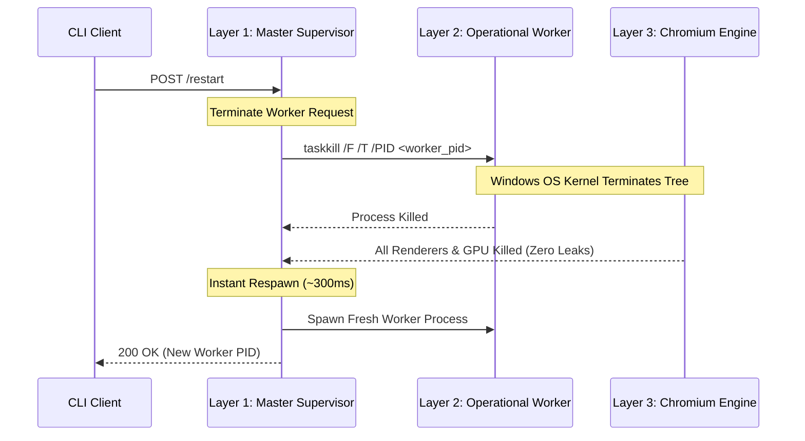
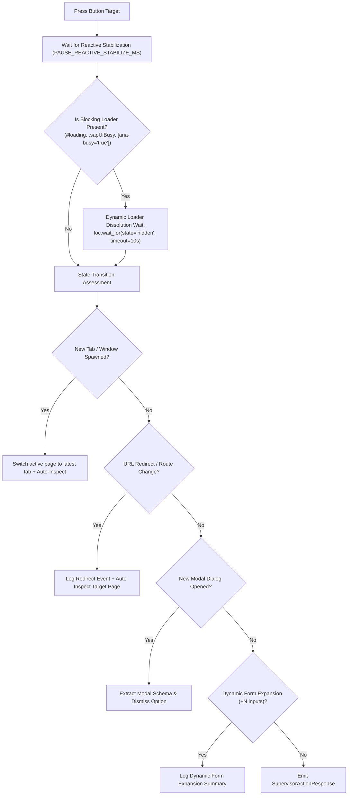

# WebPilot: Architecture Decision Record (ADR) & System Architecture Specification

## 1. Architectural Context & Problem Statement

### The Windows Process Tree / Job Object Teardown Challenge
On Microsoft Windows, modern CLI terminal runners, PowerShell consoles, and task supervisors execute commands inside a kernel-level **Windows Job Object** configured with the flag:
```c
JOB_OBJECT_LIMIT_KILL_ON_JOB_CLOSE
```
When a CLI script or subshell finishes execution, the Windows kernel walks the process tree and forcefully terminates **all child processes**, even if they were spawned with:
- `subprocess.Popen(..., creationflags=DETACHED_PROCESS)`
- `CREATE_NEW_PROCESS_GROUP`
- Python background threads or async tasks.

In automated multi-step browser workflows (e.g. `step 1: open page` -> `step 2: fill username` -> `step 3: fill password` -> `step 4: submit`), traditional automation architectures fail on Windows because:
1. Running each step as a CLI command kills the browser between steps, losing form state, session tokens, and DOM context.
2. Leaving headless Chromium running in the background often creates **zombie processes** that leak memory (often 500MB - 1GB per Chromium instance) if the supervisor crashes or loses connection.
3. Requiring administrative privileges (`asudo`, runas Administrator, or elevated Windows services) creates severe security risks, breaks automated deployment pipelines, and is completely unsuitable for general-purpose developer and agent usage.

---

## 2. The Solution: Three-Tier Multi-Process Architecture

To convert this Windows constraint into an architectural strength, the system implements a **Zero-Elevation Three-Tier Process Architecture**:

```
 ┌──────────────────────────────────────────────────────────────┐
 │                      CLI & REPL Clients                      │
 └──────────────────────────────┬───────────────────────────────┘
                                │ HTTP REST (127.0.0.1:9333)
                                ▼
 ┌──────────────────────────────────────────────────────────────┐
 │         Layer 1: Master Supervisor Host (Daemon)             │
 │   • Standard User Mode (Zero Admin, Zero Elevation)          │
 │   • Zero Playwright Imports (~15 MB RAM footprint)           │
 │   • 30-Minute Inactivity Watchdog Supervisor                 │
 │   • Zero-Touch WMI Process Breakout                          │
 └──────────────────────────────┬───────────────────────────────┘
                                │ stdin / stdout (Isolated JSON-RPC)
                                ▼
 ┌──────────────────────────────────────────────────────────────┐
 │           Layer 2: Operational Worker Process                │
 │   • Supervised Child Process of Layer 1                      │
 │   • Playwright Runtime + SessionCoordinator                  │
 │   • Persistent in-memory browser session across CLI calls    │
 │   • DOM Services (Field, Auth, Reactive, Inspection)         │
 └──────────────────────────────┬───────────────────────────────┘
                                │ Direct Process Tree Attachment
                                ▼
 ┌──────────────────────────────────────────────────────────────┐
 │              Layer 3: Chromium Browser Engine                │
 │   • Chromium Main Process + GPU + Renderers                  │
 │   • Child Process of Layer 2 Worker                          │
 │   • Immediate Cascading Kill via Windows taskkill            │
 └──────────────────────────────────────────────────────────────┘
```

---

## 3. Tier Responsibilities & Separation of Concerns

### Layer 1: Master Supervisor Host (`supervisor/master_daemon.py`)
- **Memory Footprint**: Extremely lightweight (~15 MB RAM). Does **not** import Playwright, Chromium, or DOM scripts.
- **Port**: Binds strictly to `127.0.0.1:9333` (loopback only).
- **Zero-Touch Auto-Spawn**: When a CLI client executes an action, `SupervisorClient.ensure_running()` checks if Layer 1 is alive. If not, it executes a clean WMI process launch (`Win32_Process.Create`) passing `$null` for startup information, which spawns the daemon independent of the caller's console window station and Job Object.
- **Inactivity Watchdog**: A background supervisor thread monitors idle time. If no command is received for 30 minutes (`DEFAULT_INACTIVITY_TIMEOUT_SECONDS = 1800`), it triggers `terminate_worker()`, freeing 100% of browser RAM and Chromium processes while leaving Layer 1 listening at ~15MB RAM.
- **Worker Supervision**: Communicates with Layer 2 via single-line JSON-RPC messages over standard streams (`stdin` and `stdout`).

### Layer 2: Operational Worker Process (`supervisor/worker_process.py`)
- **Runtime**: Holds the Playwright sync runtime, active `BrowserContext`, and active `Page` objects.
- **IPC Stream Isolation**: 
  - Standard `sys.stdout` is hijacked and redirected to `sys.stderr` so that all internal logs, prints, and third-party outputs never pollute the JSON-RPC data channel.
  - A reserved stream handle (`rpc_out = sys.stdout`) is used strictly to emit single-line JSON responses (`{"success": true, ...}`).
- **Session Coordinator**: Retains the active browser context and page in memory across sequential requests (`_ensure_session`), avoiding the high latency and fragility of reconnecting over CDP on every turn.

### Layer 3: Chromium Browser Engine
- **Lifecycle Attachment**: Launched directly by Layer 2 via Playwright's native `pw.chromium.launch()`.
- **Process Attachment**: Chromium is a direct child of Layer 2. Because Layer 2 stays alive in memory across CLI invocations, Chromium stays alive, fast, and directly connected.

---

## 4. Cascading Process Tree Kill & Instant Self-Healing

When a user requests a service restart (`python cli.py service restart`) or when a browser worker crashes:



1. Layer 1 executes:
   ```cmd
   taskkill /F /T /PID <worker_pid>
   ```
2. The `/T` flag instructs Windows to terminate the entire process tree rooted at `worker_pid`.
3. Layer 2 and all Layer 3 Chromium main processes, renderers, and GPU brokers are wiped instantly from memory in < 50ms.
4. Layer 1 immediately spawns a clean, fresh Layer 2 process within ~300ms.
5. **Result**: Zero zombie processes, zero memory fragmentation, and zero manual cleanup needed.

---

## 5. Reactive DOM Observer & Dynamic State Resolution

When interacting with form buttons (`--press`), modern single-page applications execute complex asynchronous state transitions:



---

## 6. Modal Trap & Reactive Interaction Pipeline

When a page presents a modal dialog, confirmation overlay, or interactive trap, WebPilot uses a non-destructive, interaction-only cascade across 4 sequential strategies in `reactive_interaction_service.py` without mutating or altering the target DOM:

1. **Strategy A (Native ID Locator)**:
   Attempts a targeted click using normalized element ID (`#clean_id`).
2. **Strategy B (Native Text & ARIA Role Cascade)**:
   Evaluates visible candidate elements across semantic role and text selectors (`button:has-text`, `[role='button']`, `.modal-footer p`, `input[type='button']`, `span:has-text`).
3. **Strategy C (JavaScript In-DOM Click Fallback)**:
   Dispatches a direct in-page click event via `CLICK_BUTTON_DOM_SCRIPT` if Playwright actionability checks are obstructed by layout overlays.
4. **Strategy D (W3C WAI-ARIA Keyboard Escape Protocol)**:
   If the target represents a dismissal action (`close`, `dismiss`, `cancel`, `escape`) or cannot be clicked directly, dispatches a physical keyboard event:
   ```python
   self.page.keyboard.press("Escape")
   ```
   Under W3C WAI-ARIA accessibility standards, compliant modal dialogs and dropdown menus listen for `Escape` to dismiss overlays and release the focus trap cleanly.

> **Design Note on DOM Integrity**: WebPilot strictly adheres to a non-destructive execution model (Read, Fill, Click). It intentionally avoids removing backdrop DOM elements or modifying inline CSS styles (`pointer-events`, `overflow`), ensuring that single-page application (SPA) state machines and anti-bot verification scripts remain completely untampered.

---

## 7. Wire Contracts & Serialization Protocol

All inter-tier communications follow strict data contracts defined in `supervisor/contracts.py`:

- **`SupervisorActionRequest`**: Contains action type (`apply`, `inspect`, `list_tabs`, `switch_tab`, `restart_worker`, `status`, `stop`), target URL, fill arguments, buttons to press, uploads, cookies path, timeout limits, and auto-inspect flags.
- **`SupervisorActionResponse`**: Returns success status, process telemetry (`browser_pid`, `worker_pid`), active tab metadata (`active_tab_index`, `active_url`, `active_title`, `total_tabs`), reactive event outcomes (`redirected`, `new_window`, `modal_opened`, `new_inputs_count`), output log lines, and the structured form schema.
